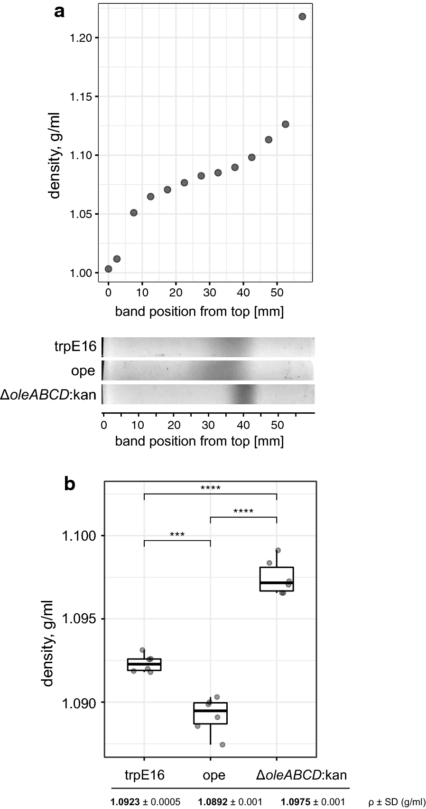
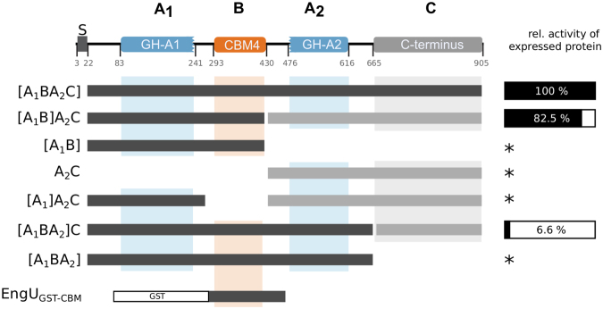

## Angel Angelov   

## Publication highlights
**for a complete list see [here]()**

   

**Variances in cellular sedimentation behavior as an effective enrichment method of
hydrocarbon-overproducing _Micrococcus luteus_ strains**   
_Biotechnol Biofuels. 2018 Oct 20;11:288_   
Angelov A, Übelacker M, Liebl W   

Background: Aliphatic hydrocarbons of microbial origin are highly interesting
candidate biofuels because these molecules are identical or very similar to the
main components of petroleum-based gasoline and diesel fuels. The high-GC
Gram-positive bacterium Micrococcus luteus is capable of naturally synthesizing
long-chain, iso- and anteiso-branched alkenes which are formed via the
head-to-head condensation of fatty acid thioesters by a dedicated enzyme system. 
The present study describes the relation we observed between olefin production
and cell buoyancy in Micrococcus luteus and the use of this phenotype to simply
and efficiently separate cells from a mixture based on their hydrocarbon content.
Methods: We generated M. luteus mutants producing different amounts of olefins
and used them in mixing and sedimentation experiments, olefin content analysis by
GC-MS and in equilibrium centrifugation in Percoll gradients.
Results: We found well-detectable differences in the buoyant densities of the
examined strains, which correlated with the amounts of hydrocarbons produced by
the cells. We also demonstrate how our observations can be used to simply and
efficiently fractionate cells based on their hydrocarbon content.
Conclusions: In summary, we show that cultures of M. luteus cells sediment at
distinct rates depending on the amounts of alkenes produced. Our results indicate
that buoyant cell density is the primary cause for the observed differences in
sedimentation behaviour. The simple separation strategy described here can be a
valuable tool in various mutagenesis and enrichment protocols, aimed at
generating and isolating strains with increased olefin productivity.

**A metagenome-derived thermostable β-glucanase with an unusual module architecture which defines the new glycoside hydrolase family GH148**   
_Sci Rep. 2017 Dec 11;7(1):17306_   

Angelov A, Pham VTT, Übelacker M, Brady S, Leis B, Pill N, Brolle J, Mechelke M, Moerch M, Henrissat B, Liebl W   
   

The discovery of novel and robust enzymes for the breakdown of plant biomass bears tremendous potential for the development of sustainable production processes in the rapidly evolving new bioeconomy. By functional screening of a metagenomic library from a volcano soil sample a novel thermostable endo-β-glucanase (EngU) which is unusual with regard to its module architecture and cleavage specificity was identified. Various recombinant EngU variants were characterized. Assignment of EngU to an existing glycoside hydrolase (GH) family was not possible. Two regions of EngU showed weak sequence similarity to proteins of the GH clan GH-A, and acidic residues crucial for catalytic activity of EngU were identified by mutation. Unusual, a carbohydrate-binding module (CBM4) which displayed binding affinity for β-glucan, lichenin and carboxymethyl-cellulose was found as an insertion between these two regions. EngU hydrolyzed β-1,4 linkages in carboxymethyl-cellulose, but displayed its highest activity with mixed linkage (β-1,3-/β-1,4-) glucans such as barley β-glucan and lichenin, where in contrast to characterized lichenases cleavage occurred predominantly at the β-1,3 linkages of C4-substituted glucose residues. EngU and numerous related enzymes with previously unknown function represent a new GH family of biomass-degrading enzymes within the GH-A clan. The name assigned to the new GH family is GH148

